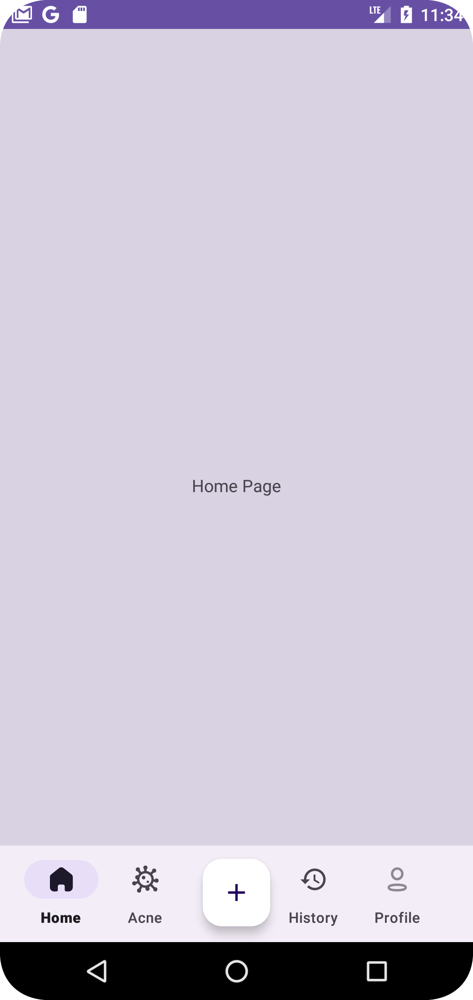

# Acnetify App

A mobile application to identify acne types and recommend acne treatment product ingredients to help 
users. The app is created by identifying the type of acne that corresponds to the data we have 
trained with our model through the user's smartphone camera or uploaded photos.

| Project Name                 | Acnetify                       |
|------------------------------|--------------------------------|
| Minimum Target SDK           | Phone and Tablet, API level 24 |
| Activity Type                | Empty Views Activity           |
| Language                     | Kotlin                         |
| Build Configuration Language | Kotlin DSL                     |

| Features       |
|----------------|
| Authentication |
| Feeds          |
| Profile        |
| Acne Types     |
| Acne History   |
| Acne Detail    |
| Acne Upload    |

## 👀 Previews

This the output application after running the project:

    

